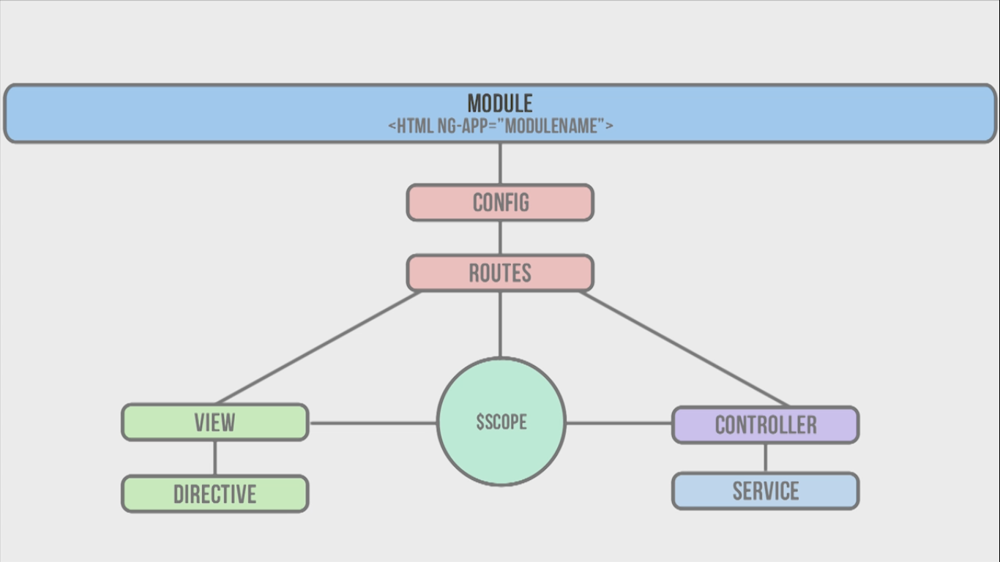

## Special about Angular JS

1. Great code organization
2. Testable code 
3. template is html that you already know
4. two way data binding saves you 100 of lines of code.

## Big Picture



## Hello World

```
ng-app
ng-controller
ng-click
ng-show/ng-hide
filter
ng-init
ng-repeat
```